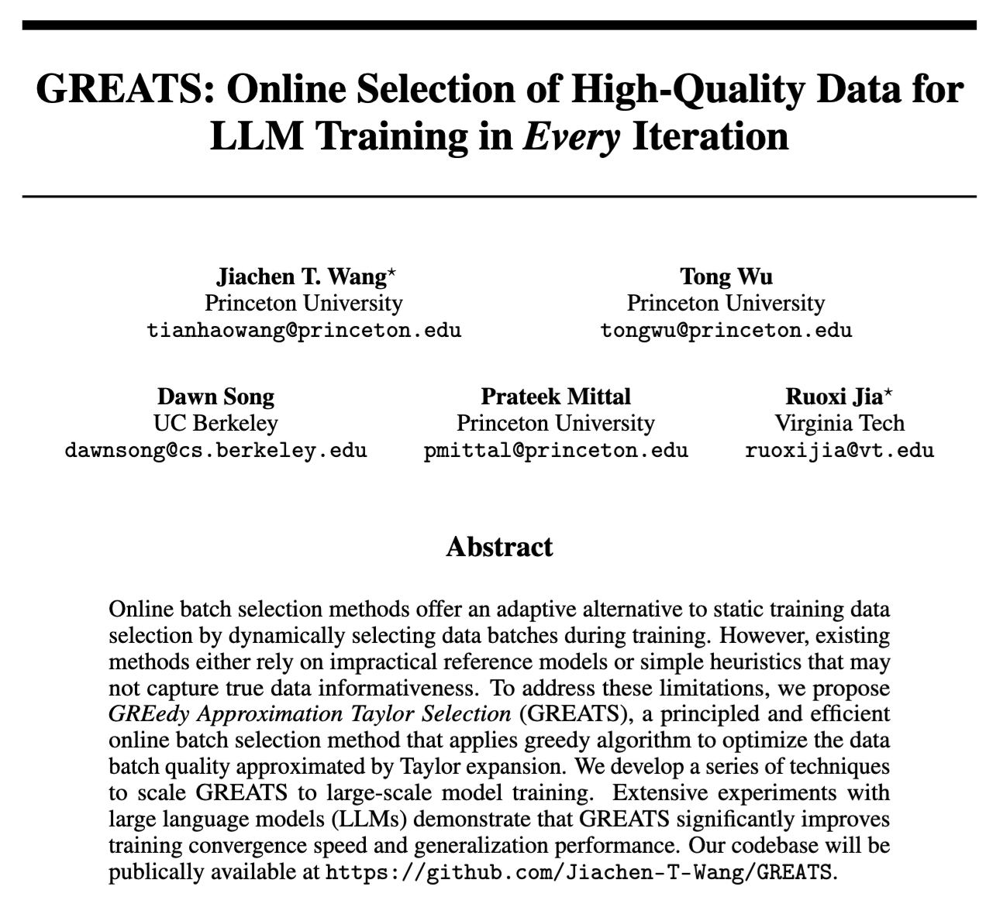
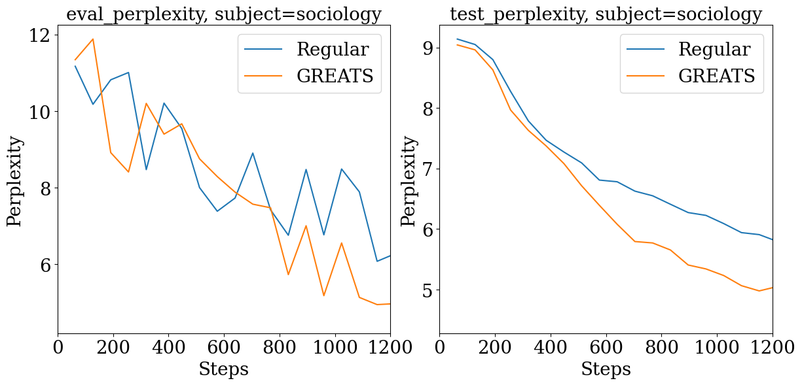

# GREATS: Online Selection of High-Quality Data for LLM Training in Every Iteration

[](https://openreview.net/pdf?id=232VcN8tSx)

<div style="text-align: center;">
    
</div>


## Quick Start

```bash
pip install -r requirement.txt
```

Run experiments using:
```bash
sh online_batch_select_mmlu.sh Regular 4 0.05 5 mmlu llama2 1 2e-05 11 1 sociology
sh online_batch_select_mmlu.sh GREATS 2 0.05 5 mmlu llama2 1 2e-05 11 1 sociology
```

The result from the trial run:


**Note:** to make it compatible with gradient accumulation, in the current implementation of ghost inner product we still use 2 forward-backward passes. 


### Parameters

```bash
sh online_batch_select_mmlu.sh \
    <selection_method>  # Batch selection strategy. Options: Regular, GREATS, GradNorm, MaxLoss, RHO-Loss, SBERT.
    <batch_size>        # Batch size for training. 
    <data_percentage>   # Percentage of the full dataset used for training (for faster test). 
    <validation_size>   # Size of the validation set. 
    <task>              # Task name for the model (e.g., a classification or QA task).
    <model>             # Model name or path to the pretrained model.
    <lora_alpha>        # LoRA hyperparameter (if applicable).
    <learning_rate>     # Learning rate for the optimizer.
    [seed]              # Random seed for reproducibility.
    [gradient_accumulation_steps]  # Number of gradient accumulation steps.
    [subject]           # Dataset subject.
```

## Citation

```bibtex
@inproceedings{
    wang2024greats,
    title={{GREATS}: Online Selection of High-Quality Data for {LLM} Training in Every Iteration},
    author={Jiachen T. Wang and Tong Wu and Dawn Song and Prateek Mittal and Ruoxi Jia},
    booktitle={The Thirty-eighth Annual Conference on Neural Information Processing Systems},
    year={2024},
    url={https://openreview.net/forum?id=232VcN8tSx}
}
```

## Contact
If you have any issues running the codebase, feel free to contact us at tianhaowang@princeton.edu. 

## Acknowledgments

The codebase builds upon [LESS](https://github.com/princeton-nlp/LESS). 